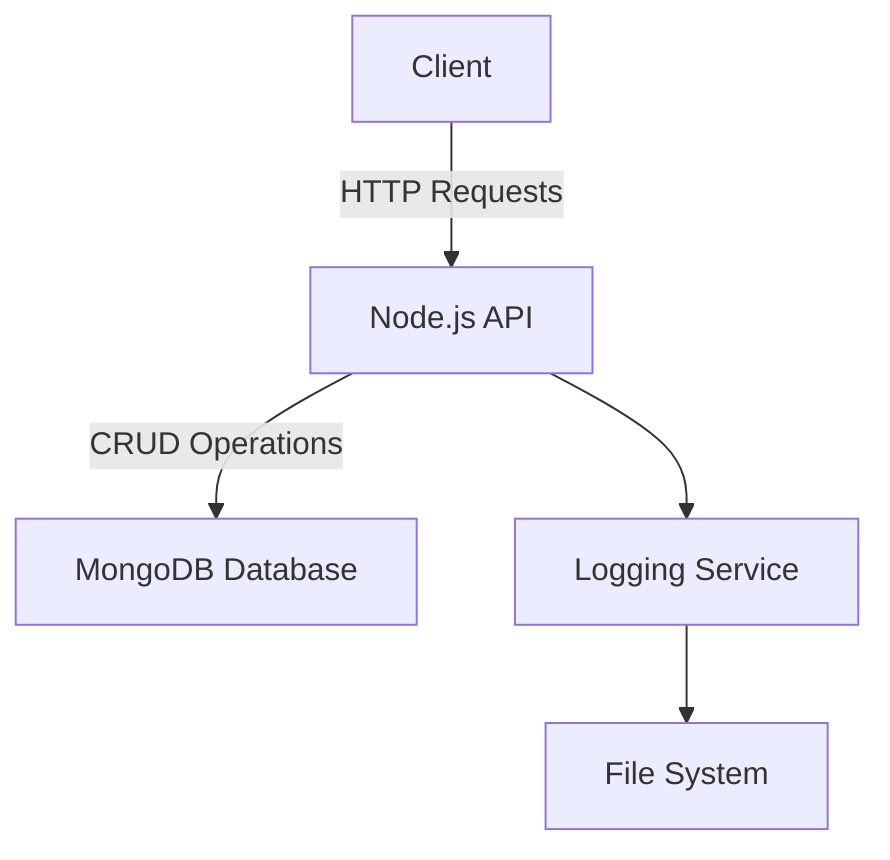
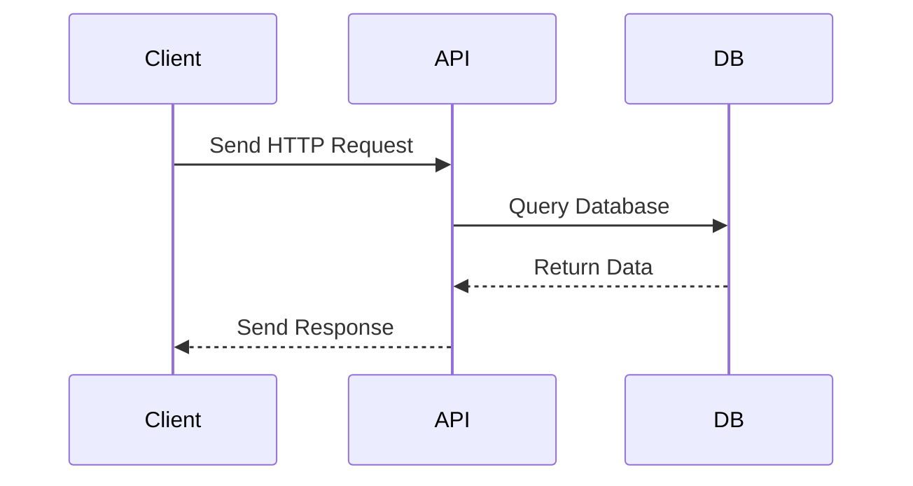

# Sample Node.js Application

This document provides an overview of a sample Node.js application, including its architecture and workflow, illustrated with Mermaid diagrams.

---

## Application Overview

The sample Node.js application is a RESTful API that performs CRUD operations on a database. It uses the following technologies:

- **Node.js**: JavaScript runtime for building the application.
- **Express.js**: Web framework for handling HTTP requests.
- **MongoDB**: NoSQL database for data storage.

---

## Architecture Diagram



---

## Workflow Diagram



---

## Project Structure

The project follows a modular structure:

```
project/
├── src/
│   ├── controllers/
│   ├── models/
│   ├── routes/
│   └── app.js
├── config/
├── tests/
└── package.json
```

---

## Reference Links

- [Node.js Documentation](https://nodejs.org/en/docs/)
- [Express.js Guide](https://expressjs.com/)
- [MongoDB Documentation](https://www.mongodb.com/docs/)
- [Mermaid Documentation](https://mermaid-js.github.io/mermaid/)
